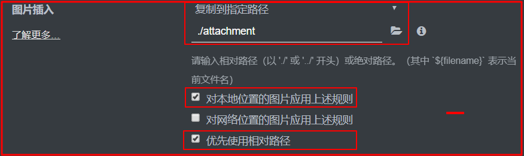

## 08-Typora + GitHub 个人笔记
* Typora 
  * markdown 编辑器，可设置遵循"GFM’s spec"，标准化markdown 
  
  * 设置图片插入: 加载本地图片后会自动复制图片到设置的文件夹
  
  
* GitHub   
  代码托管器，Git push markdown文件和图片文件夹 至 GitHub，这样就可以在线访问markdown文件，其图片也能正常显示

